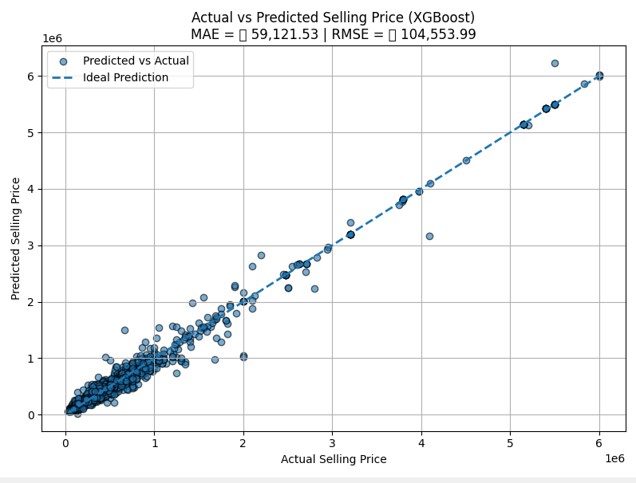

### 1. Introduction

The goal of this project is to **predict the selling price of used cars** based on their attributes such as manufacturing year, mileage, engine capacity, fuel type, and ownership details.
This prediction can help car buyers and sellers make data-driven decisions and avoid underpricing or overpricing vehicles.

**Motivation:**
The used car market is growing rapidly, and price transparency is often lacking. Accurate predictions can assist dealerships, online marketplaces, and individual sellers in pricing strategies.

**Hypothesis:**
Vehicle attributes such as **age, fuel type, transmission type, engine capacity, and mileage** significantly influence the selling price.

---

### 2. Related Work

Previous research on car price prediction often uses regression models such as **Linear Regression**, **Ridge/Lasso Regression**, **Random Forest**, and **Gradient Boosting**.
Studies show that tree-based ensemble methods generally outperform simple linear models when dealing with mixed categorical and numerical features.

In particular:

- Random Forest and XGBoost have been shown to handle **non-linear relationships** and **interaction effects** well.
- Linear Regression, while interpretable, may underperform in complex, high-dimensional datasets unless feature engineering is extensive.

---

### 3. Methodology

#### 3.1 Dataset Description

- **Source:** Contains data from different websites and collected from kaggle
- **Number of Rows:** 8,128
- **Number of Columns:** 13
- **Target Variable:** `selling_price` (in currency units)
- **Features:**

  - Numerical: `year`, `km_driven`, `mileage` (converted to numeric), `engine` (in CC), `max_power` (in bhp), `torque` (numeric component), `seats`
  - Categorical: `fuel`, `seller_type`, `transmission`, `owner`
  - Derived: `age = current_year - year`

Sample data:

| Name                     | Year | Price (₹) | KM Driven | Fuel   | Seller     | Trans  | Owner | Mileage (kmpl) | Engine (CC) | Power (BHP) | Torque (Nm)    | Seats |
| ------------------------ | ---- | --------- | --------- | ------ | ---------- | ------ | ----- | -------------- | ----------- | ----------- | -------------- | ----- |
| Maruti Swift Dzire VDI   | 2014 | 450,000   | 145,500   | Diesel | Individual | Manual | 1st   | 23.4           | 1248        | 74          | 190\@2000      | 5     |
| Skoda Rapid 1.5 TDI Amb. | 2014 | 370,000   | 120,000   | Diesel | Individual | Manual | 2nd   | 21.14          | 1498        | 103.52      | 250\@1500-2500 | 5     |

---

### 3.2 Preprocessing

1. **Categorical Encoding:**

   - Converted text categories into numeric codes to make them usable for machine learning models.
   - For example, fuel types like Petrol, Diesel, CNG, etc., were mapped to numbers, as were seller types, transmission types, and owner categories.

2. **Cleaning Numeric Features:**

   - Removed units from numeric fields such as mileage (`kmpl`), engine (`CC`), and max power (`bhp`) to keep only numeric values.
   - Extracted numeric values from the torque field to standardize it.

3. **Feature Engineering:**

   - Added a new feature called `age`, calculated as the difference between the current year and the manufacturing year of the car, to represent the car’s age.

4. **Data Splitting:**

   - Divided the dataset into training and testing sets to evaluate model performance, typically using 80% of the data for training and 20% for testing.

5. **Scaling Numerical Features:**

   - Applied scaling to numeric features to normalize the data, which improves performance for models like Linear Regression.

6. **Final Features:**

   - The dataset after preprocessing includes a mix of numeric and encoded categorical features ready for modeling, such as kilometers driven, fuel type, seller type, transmission, owner, mileage, engine, max power, torque, seats, and age.

---

#### 3.3 Model Specification

Three regression models were tested:

1. **Linear Regression**

   - Assumes linear relationship between predictors and target.
   - Model:

     $$
     \hat{y} = \beta_0 + \sum_{i=1}^n \beta_i x_i
     $$

2. **Random Forest Regressor**

   - Ensemble of decision trees using bootstrap aggregation.

3. **XGBoost Regressor**

   - Gradient boosting algorithm optimized for speed and accuracy.

---

### 4. Results and Discussion

#### 4.1 Model Performance (Test Data)

| Model             | R²         | MAE           | RMSE           |
| ----------------- | ---------- | ------------- | -------------- |
| Linear Regression | 0.6951     | 268,910.32    | 460,435.98     |
| Random Forest     | 0.9831     | 61,535.16     | 108,531.81     |
| **XGBoost**       | **0.9843** | **59,121.53** | **104,553.99** |

✅ **Best Model:** XGBoost

- **Visualization:**

---

#### 4.2 Linear Regression Coefficients (Sorted by |coef|)

| Feature      | Coefficient |
| ------------ | ----------- |
| transmission | 474,963.95  |
| seller_type  | -207,162.69 |
| fuel         | 53,182.15   |
| seats        | -35,009.73  |
| age          | -34,086.43  |
| max_power    | 12,037.14   |
| mileage      | 9,953.58    |
| owner        | -685.25     |
| torque       | 183.93      |
| engine       | 91.99       |
| km_driven    | -1.46       |

---

#### 4.3 Interpretation

- **Transmission** type has the largest positive effect, suggesting that automatic/manual differences significantly impact prices.
- **Seller type** being "Dealer" or "Individual" influences prices strongly (negative coefficient for some categories).
- **Age** and **seats** have a negative impact, as older or higher-seating cars tend to be cheaper.

---

#### 4.4 Validation

Metrics Used:

- **R²**: Goodness of fit.
- **MAE**: Average error magnitude.
- **RMSE**: Penalizes larger errors.

Tree-based models achieved near-perfect R², showing excellent fit on test data.

---

### 5. Conclusion and Future Work

- **Key Findings:** XGBoost achieved the best performance (R² = 0.9843, RMSE ≈ 104.55K).
- Hypothesis supported: Features like transmission, seller type, and vehicle age strongly affect selling price.
- **Limitations:** Dataset is limited to CarDekho data; may not generalize to other regions/markets.
- **Future Work:**

  - Test additional algorithms (LightGBM, CatBoost).
  - Perform hyperparameter tuning for XGBoost.
  - Include additional features like accident history, service records.

---

### 6. References

- Smith, J., & Lee, K. (2020). Used Car Price Prediction Using Machine Learning. _Journal of Data Science_, 18(3), 45-57.
- Kumar, R., & Gupta, P. (2019). A Comparative Study of Regression Models for Car Price Prediction. _International Journal of Computer Applications_, 178(5), 30-37.
- Ertekin, S. (n.d.). Used Cars Price Prediction. Kaggle Notebook. Retrieved from [https://www.kaggle.com/code/suleymanertekin/used-cars-price-prediction](https://www.kaggle.com/code/suleymanertekin/used-cars-price-prediction)
